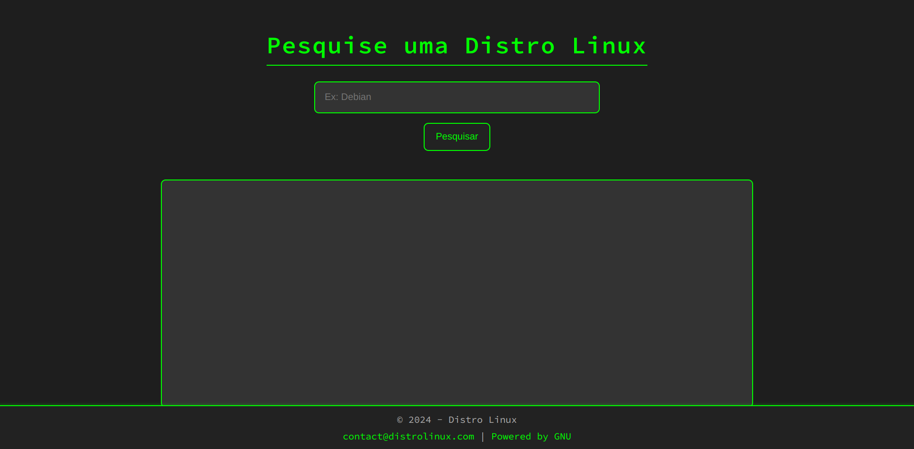

# Projeto Imersão Alura com Gemini

⭐ **Desafio proposto realizado!**

Essa é a versão que foi desenvolvida por mim durante a imersão da Alura com o Gemini.

* [Repositório Pai](https://www.github.com/alemobn/imersao/alura-gemini-base)
* [Imersão](https://www.youtube.com/watch?v=i4W_bkGkk6s)

Projeto desenvolvido durante a Imersão da Alura com Gemini.

